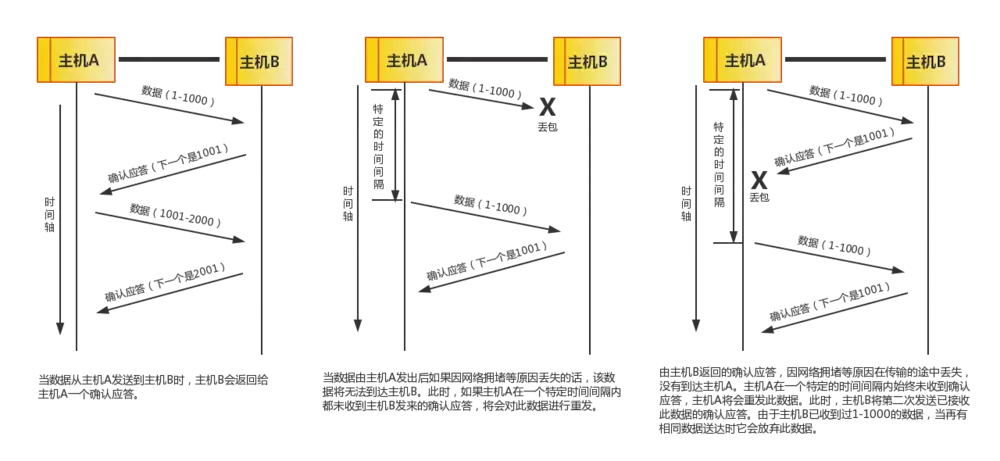

### TCP/IP 协议群

### 数据处理流程

### TCP/IP

#### 通过 IP 地址、端口号、协议号进行通信识别

- ① 和② 的通信是在两台计算机上进行的。它们的目标端口号相同，都是80。这里可以根据源端口号加以区分。
- ③ 和 ① 的目标端口号和源端口号完全相同，但它们各自的源 IP 地址不同。
- 此外，当 IP 地址和端口号全都一样时，我们还可以通过协议号来区分（TCP 和 UDP）。

#### 端口号的确定

- 标准既定的端口号：这种方法也叫静态方法。它是指每个应用程序都有其指定的端口号。但并不是说可以随意使用任何一个端口号。例如 HTTP、FTP、TELNET 等广为使用的应用协议中所使用的端口号就是固定的。这些端口号被称为知名端口号，分布在 0~1023 之间。

  除知名端口号之外，还有一些端口号被正式注册，它们分布在 1024~49151 之间，不过这些端口号可用于任何通信用途。

- 时序分配法：服务器有必要确定监听端口号，但是接受服务的客户端没必要确定端口号。在这种方法下，客户端应用程序完全可以不用自己设置端口号，而全权交给操作系统进行分配。动态分配的端口号范围在 49152~65535 之间。

#### 三握手

- 第一次握手：客户端将标志位SYN置为1，随机产生一个值seq=J，并将该数据包发送给服务器端，客户端进入SYN_SENT状态，等待服务器端确认。
- 第二次握手：服务器端收到数据包后由标志位SYN=1知道客户端请求建立连接，服务器端将标志位SYN和ACK都置为1，ack=J+1，随机产生一个值seq=K，并将该数据包发送给客户端以确认连接请求，服务器端进入SYN_RCVD状态。
- 第三次握手：客户端收到确认后，检查ack是否为J+1，ACK是否为1，如果正确则将标志位ACK置为1，ack=K+1，并将该数据包发送给服务器端，服务器端检查ack是否为K+1，ACK是否为1，如果正确则连接建立成功，客户端和服务器端进入ESTABLISHED状态，完成三次握手，随后客户端与服务器端之间可以开始传输数据了。

#### 四挥手

- 中断连接端可以是客户端，也可以是服务器端。
- 第一次挥手：客户端发送一个FIN=M，用来关闭客户端到服务器端的数据传送，客户端进入FIN_WAIT_1状态。意思是说"我客户端没有数据要发给你了"，但是如果你服务器端还有数据没有发送完成，则不必急着关闭连接，可以继续发送数据。
- 第二次挥手：服务器端收到FIN后，先发送ack=M+1，告诉客户端，你的请求我收到了，但是我还没准备好，请继续你等我的消息。这个时候客户端就进入FIN_WAIT_2 状态，继续等待服务器端的FIN报文。
- 第三次挥手：当服务器端确定数据已发送完成，则向客户端发送FIN=N报文，告诉客户端，好了，我这边数据发完了，准备好关闭连接了。服务器端进入LAST_ACK状态。**（此时服务端会启动超时重传计时器）**
- 第四次挥手：客户端收到FIN=N报文后，就知道可以关闭连接了，但是他还是不相信网络，怕服务器端不知道要关闭，所以发送ack=N+1后进入TIME_WAIT状态，如果Server端没有收到ACK则可以重传。服务器端收到ACK后，就知道可以断开连接了。客户端等待了2MSL后依然没有收到回复，则证明服务器端已正常关闭，那好，我客户端也可以关闭连接了。最终完成了四次握手。

#### 可靠性如何保证？

**通过序列号与确认应答提高可靠性**

- 在 TCP 中，当发送端的数据到达接收主机时，接收端主机会返回一个已收到消息的通知。这个消息叫做确认应答（ACK）。当发送端将数据发出之后会等待对端的确认应答。如果有确认应答，说明数据已经成功到达对端。反之，则数据丢失的可能性很大。
- 序列号是按照顺序给发送数据的每一个字节（8位）都标上号码的编号。接收端查询接收数据 TCP 首部中的序列号和数据的长度，将自己下一步应该接收的序列号作为确认应答返送回去。通过序列号和确认应答号，TCP 能够识别是否已经接收数据，又能够判断是否需要接收，从而实现可靠传输。

#### 重发超时的确定

- **重发超时是指在重发数据之前，等待确认应答到来的那个特定时间间隔。**如果超过这个时间仍未收到确认应答，发送端将进行数据重发。最理想的是，找到一个最小时间，它能保证“确认应答一定能在这个时间内返回”。
- 数据被重发之后若还是收不到确认应答，则进行再次发送。此时，等待确认应答的时间将会以2倍、4倍的指数函数延长。
- 此外，**数据也不会被无限、反复地重发。达到一定重发次数之后，如果仍没有任何确认应答返回，就会判断为网络或对端主机发生了异常，强制关闭连接。并且通知应用通信异常强行终止。**

#### 发送和接收数据包大小的确定

- 在建立 TCP 连接的同时，也可以确定发送数据包的单位（段），我们也可以称其为“最大消息长度”（MSS）。
- TCP 在传送大量数据时，是以 MSS 的大小将数据进行分割发送。进行重发时也是以 MSS 为单位。
- MSS 在三次握手的时候，在两端主机之间被计算得出。两端的主机在发出建立连接的请求时，会在 TCP 首部中写入 MSS 选项，告诉对方自己的接口能够适应的 MSS 的大小。然后会在两者之间选择一个较小的值投入使用。

#### 利用窗口控制提高速度

- TCP 以1个段为单位，每发送一个段进行一次确认应答的处理。这样的传输方式有一个缺点，就是包的往返时间越长通信性能就越低。
- 为解决这个问题，TCP 引入了窗口这个概念。确认应答不再是以每个分段，而是以更大的单位进行确认，转发时间将会被大幅地缩短。

#### 滑动窗口控制

* 窗口内的数据即便没有收到确认应答也可以被发送出去，不过，在整个窗口的确认应答没有到达之前，如果其中部分数据出现丢包，那么发送端仍然要负责重传。
* 滑动窗口以外的部分包括未发送的数据以及已经确认对端已收到的数据。当数据发出后若如期收到确认应答就可以不用再进行重发，此时数据就可以从缓存区清除。
* 收到确认应答的情况下，将窗口滑动到确认应答中的序列号的位置。这样可以顺序地将多个段同时发送提高通信性能。这种机制也别称为滑动窗口控制。

#### 窗口控制中的重发控制

-  ① 确认应答未能返回的情况。在这种情况下，数据已经到达对端，是不需要再进行重发的，如下图：

- **高速重发控制**  ② 某个报文段丢失的情况。接收主机如果收到一个自己应该接收的序列号以外的数据时，会针对当前为止收到数据返回确认应答。如下图所示，当某一报文段丢失后，发送端会一直收到序号为1001的确认应答，因此，在窗口比较大，又出现报文段丢失的情况下，同一个序列号的确认应答将会被重复不断地返回。而发送端主机如果连续3次收到同一个确认应答，就会将其对应的数据进行重发。这种机制比之前提到的超时管理更加高效，因此也被称为高速重发控制。

### 网络层 IP

- IP（IPv4、IPv6）相当于 OSI 参考模型中的第3层——网络层。网络层的主要作用是“实现终端节点之间的通信”。这种终端节点之间的通信也叫“点对点通信”。
- 网络的下一层——数据链路层（MAC 地址）的主要作用是在互连同一种数据链路的节点之间进行包传递。而一旦跨越多种数据链路，就需要借助网络层。
- IP 大致分为三大作用模块，它们是 IP 寻址、路由以及 IP 分包与组包。

#### ip地址的网络标识

#### IP 地址的分类

- **IP 地址分为四个级别，分别为A类、B类、C类、D类。它根据 IP 地址中从第 1 位到第 4 位的比特列对其网络标识和主机标识进行区分。**

- **A 类 IP 地址是首位以 “0” 开头的地址。**

  从第 1 位到第 8 位是它的网络标识。用十进制表示的话，0.0.0.0~127.0.0.0 是 A 类的网络地址。A 类地址的后 24 位相当于主机标识。因此，一个网段内可容纳的主机地址上限为16,777,214个。

- **B 类 IP 地址是前两位 “10” 的地址。**

  从第 1 位到第 16 位是它的网络标识。用十进制表示的话，128.0.0.0~191.255.0.0 是 B 类的网络地址。B 类地址的后 16 位相当于主机标识。因此，一个网段内可容纳的主机地址上限为65,534个。

- **C 类 IP 地址是前三位为 “110” 的地址。**

  从第 1 位到第 24 位是它的网络标识。用十进制表示的话，192.0.0.0~223.255.255.0 是 C 类的网络地址。C 类地址的后 8 位相当于主机标识。因此，一个网段内可容纳的主机地址上限为254个。

- **D 类 IP 地址是前四位为 “1110” 的地址。**

  从第 1 位到第 32 位是它的网络标识。用十进制表示的话，224.0.0.0~239.255.255.255 是 D 类的网络地址。D 类地址没有主机标识，常用于多播。

在分配 IP 地址时关于主机标识有一点需要注意。即要用比特位表示主机地址时，不可以全部为 0 或全部为 1。因为全部为 0 只有在表示对应的网络地址或 IP 地址不可以获知的情况下才使用。而全部为 1 的主机通常作为广播地址。因此，在分配过程中，应该去掉这两种情况。这也是为什么 C 类地址每个网段最多只能有 254（ 28 - 2 = 254）个主机地址的原因。

#### 广播地址

- 广播地址用于在同一个链路中相互连接的主机之间发送数据包。将 IP 地址中的主机地址部分全部设置为 1，就成了广播地址。
- 广播分为本地广播和直接广播两种。在本网络内的广播叫做本地广播；在不同网络之间的广播叫做直接广播。

#### IP 多播

- 多播用于将包发送给特定组内的所有主机。由于其直接使用 IP 地址，因此也不存在可靠传输。
- 相比于广播，多播既可以穿透路由器，又可以实现只给那些必要的组发送数据包。
- 多播使用 D 类地址。因此，如果从首位开始到第 4 位是 “1110”，就可以认为是多播地址。而剩下的 28 位可以成为多播的组编号。
- 此外， 对于多播，所有的主机（路由器以外的主机和终端主机）必须属于 224.0.0.1 的组，所有的路由器必须属于 224.0.0.2 的组。

#### 子网掩码

- 现在一个 IP 地址的网络标识和主机标识已不再受限于该地址的类别，而是由一个叫做“子网掩码”的识别码通过子网网络地址细分出比 A 类、B 类、C 类更小粒度的网络。这种方式实际上就是将原来 A 类、B 类、C 类等分类中的主机地址部分用作子网地址，可以将原网络分为多个物理网络的一种机制。
- 子网掩码用二进制方式表示的话，也是一个 32 位的数字。它对应 IP 地址网络标识部分的位全部为 “1”，对应 IP 地址主机标识的部分则全部为 “0”。由此，一个 IP 地址可以不再受限于自己的类别，而是可以用这样的子网掩码自由地定位自己的网络标识长度。当然，子网掩码必须是 IP 地址的首位开始连续的 “1”。
- 对于子网掩码，目前有两种表示方式。第一种是，将 IP 地址与子网掩码的地址分别用两行来表示。以 172.20.100.52 的前 26 位是网络地址的情况为例，如下：

- 第二种表示方式是，在每个 IP 地址后面追加网络地址的位数用 “/ ” 隔开，如下：

  

#### 路由

- 发送数据包时所使用的地址是网络层的地址，即 IP 地址。然而仅仅有 IP 地址还不足以实现将数据包发送到对端目标地址，在数据发送过程中还需要类似于“指明路由器或主机”的信息，以便真正发往目标地址。保存这种信息的就是路由控制表。
- 该路由控制表的形成方式有两种：一种是管理员手动设置，另一种是路由器与其他路由器相互交换信息时自动刷新。前者也叫做静态路由控制，而后者叫做动态路由控制。
- IP 协议始终认为路由表是正确的。然后，IP 本身并没有定义制作路由控制表的协议。即 IP 没有制作路由控制表的机制。该表示由一个叫做“路由协议”（RIP 和 OSPF）的协议制作而成。

#### IPv6 的特点

- IP 地址的扩大与路由控制表的聚合。
- 性能提升。包首部长度采用固定的值（40字节），不再采用首部检验码。简化首部结构，减轻路由器负担。路由器不再做分片处理。
- 支持即插即用功能。即使没有DHCP服务器也可以实现自动分配 IP 地址。
- 采用认证与加密功能。应对伪造 IP 地址的网络安全功能以及防止线路窃听的功能。
- 多播、Mobile IP 成为扩展功能。

