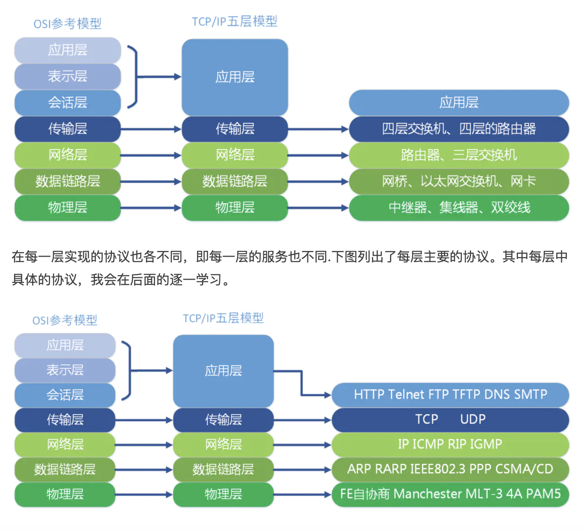
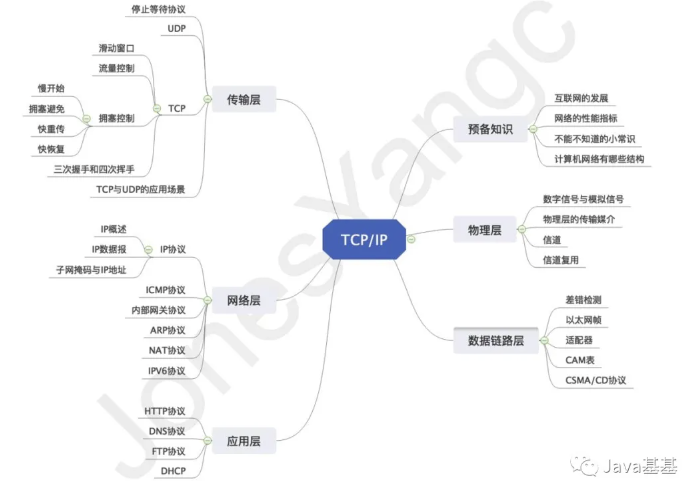
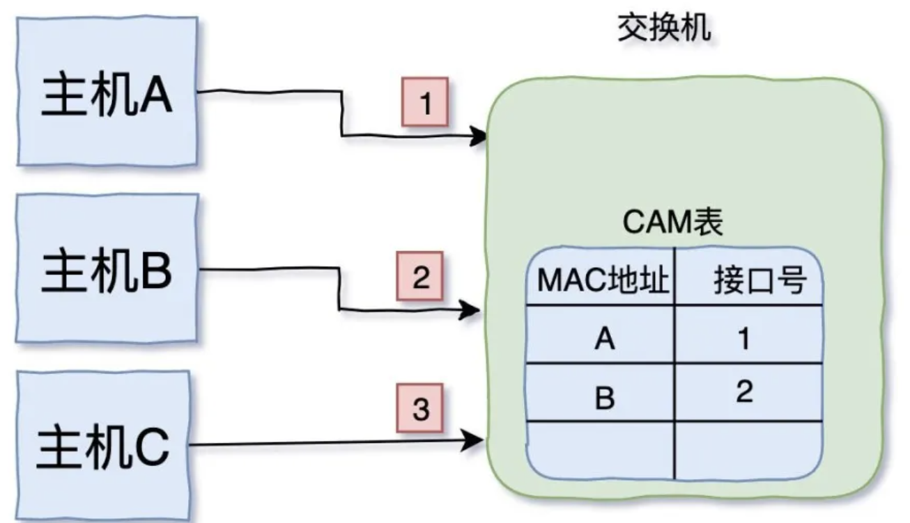

### OSI 和 TCP/IP 网络分层模型

TCP/IP 与 OSI 在分层模块上稍有区别。OSI 参考模型注重 “通信协议必要的功能是什么”，而 TCP/IP 则更强调，“在计算机上实现协议应该开发哪种程序”

### 各层网络协议

### 应用层协议

**DHCP：**

动态主机设置协议（DHCP）是一种使网络管理员能够集中管理和自动分配IP网络地址的通信协议。

在IP网络中，每个连接Internet的设备都需要分配唯一的IP地址。DHCP使网络管理员能从中心结点监控和分配IP地址。当某台计算机移到网络中的其它位置时，能自动收到新的IP地址。

### 传输层协议

**停止等待协议：**

停止等待协议可以由以下三个部分组成：

- 无差错情况 ：为了保证无差错的情况，主机A还要继续向主机B发送消息，就必须得到主机B的回复。
- 出现差错 ：如果出现差错，比如主机A一直没有收到主机B的回复，那么就会有一种机制，使得主机A把这条消息再一次发送给主机B。这中间涉及到一个重传时间 的选择，这里得话，这个重传时间应该不小于RTT（主机A给主机B发送消息，主机B再给主机A发送消息的时间和）。
- 确认丢失和确认迟到 ：确认迟到和确认丢失。

**ARQ 协议：**

ARQ协议就是发送方不必收到对上一条消息的确认，一次可以发出多个分组，这样就提高了信道的利用，可以在某一时间内传送足够的数据量。

**UDP 协议：**

- 面向无连接的协议，进行不可靠的传输
- 面向数据报
- 没有拥塞控制
- UDP数据报首部开销小
- 支持一对一，一对多，多对多，多对一的数据传输

**TCP 协议：**

- TCP协议是面向连接的传输层协议
- 提供可靠交付
- 使用全双工通信
- 面向字节流
- 顺序，重发，流量，拥塞控制

TCP 的这些机制，在 IP 这种无状态连接的网络上也能够实现高可靠性的通信（ 主要通过检验和、序列号、确认应答、重发控制、连接管理以及窗口控制等机制实现）。

### 网络层协议

**ICMP：**

互联网控制消息协议（英语：Internet Control Message Protocol，缩写：ICMP）是互联网协议族的核心协议之一。

它用于网际协议（IP）中发送控制消息，提供可能发生在通信环境中的各种问题反馈。

通过这些信息，使管理者可以对所发生的问题作出诊断，然后采取适当的措施解决。

ICMP 依靠IP来完成它的任务，它是IP的主要部分。它与传输协议（如TCP和UDP）显著不同：它一般不用于在两点间传输数据。它通常不由网络程序直接使用，除了 ping 和 traceroute 这两个特别的例子。 IPv4中的ICMP被称作ICMPv4，IPv6中的ICMP则被称作ICMPv6。

ICMP协议 的 TTL 和 DNS 的不一样。

二者都是生存时间，前者指ICMP包的转发次数（跳数），后者指域名解析信息在DNS中的存在时间。

**路由表：**

记录 IP对应关系。

**内部网关协议：**

RIP 和 OSPF，功能主要用来生成路由表。

OSPF：

 OSPF是个路由协议，让路由器将其链路信息 (link state) 互相传送，在所有的路由器都有同样的链接信息时，它们对拓扑有个共同的认识，可以分别计算通往各个目的地址的最佳路由路径，记录到路由表。这时，路由器就可以正确的把数据包在计算机间转发了。 

什么是LSA（Link-State Advertisement）：链路状态通告，主要用于维护每台路由器的LSDB数据库，当拓扑发生更新时（添加新设备或者接口Down/UP等），发生变更的路由器会将LSU封装于LSA中发送到全网路由器。

这些路由器收到LSA之后，会将LSA数据包中的序列号与自己LSDB中对应的那条LSA条目的序列号进行对比，如果序列号的值大于自己，则使用这条LSA更新自己的LSDB，如果该序列号比自己小，则将会给对方发送封装有LSU的LSA更新包，让对方同步LSDB，LSA也会周期性的泛洪，默认时间为3600s（半小时），发出LSA中的序列号会在现有的基础上+1

OSPF 图解：https://blog.51cto.com/visualland/408923

### 数据链路层协议

**CSMA/CD：**

载波侦听多路访问/冲突检测

为了解决集线器 Hub 时代的问题。因为Hub 不管数据是谁发给谁，只是一个没有感情的转发机器，工作在物理层，把收到的信号做一个增强处理后就一股脑的发给所有端口。

CSMA/CD 协议：每次要发送数据之前，监听一下线路上是否空闲，如果有别人在传输数据，就等待。不知道等待多久，因为这是一个随机值。

等到空闲的时候，就可以发送数据了。不过一边发送，还得一边检测是否有冲突发生，因为可能有其它机器在发送数据。

**ARP：**

地址解析协议，网卡的 MAC 地址 和 IP 地址的相互转换。

**CAM 表：**

用来记录机器MAC地址 和 连接交换机端口的关系。

