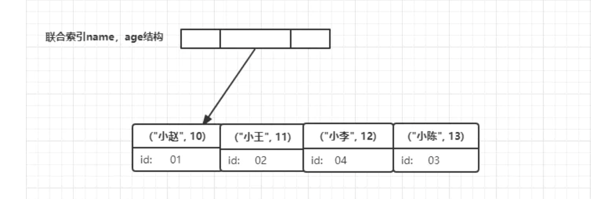

## 一起教育

### 一面

#### 1、线程池

线程池的参数 和 再实际运行中它们的作用。

线程池的阻塞队列放的是什么：

创建线程的任务。

#### 2、mysql 深分页怎么处理？

1、同样也是分页，但是有个maxId的限制条件，maxId就是上一页中的最大主键Id。

条件是 where id > maxId 查询。

所以采用此方式的前提：

1）主键必须自增不能是UUID。

2）前端除了传基本分页参数pageNo,pageSize外，还必须把每次上一页的最大Id带过来。

#### 3、redis key 删除策略

⚠️：注意和内存淘汰策略区分。

过期 key 删除策略

删除到达过期时间的 key 。

**第一种：定时检查删除**

对于每一个设置了过期时间的 key 都会创建一个定时器，一旦达到过期时间都会删除。这种方式立即清除过期数据，对内存比较好，

但是有缺点是：占用了大量 CPU 的资源去处理过期数据，会影响 redis 的吞吐量 和 响应时间。

**第二种：惰性检查删除**

当访问一个 key 的时候，才会判断该 key 是否过期，如果过期就删除。该方式能最大限度节省 CPU 的资源。

但是对内存不太好，有一种比较极端的情况：出现大量的过期 key 没有被再次访问，因为不会被清除，导致占用了大量的内存。

**第三种：定期检查删除**

每隔一段时间，扫描redis 中过期key 的字典，并清除部分过期的key。这种方式是前俩种一种折中方法。不同的情况下，调整定时扫描时间间隔，让CPU 与 内存达到最优。

#### 4、redis 怎么避免缓存雪崩问题

* 事前：合理设置不同类型 key 的过期时间，避免同一时刻大面积 key 失效
* 事中：本地ehcache缓存 + hystrix限流&降级，避免MySQL崩掉 

#### 5、使用覆盖索引的好处

什么是覆盖索引：

建立联合索引：ALTER TABLE student ADD INDEX I_name_age(name, age);

查询语句：

SELECT age FROM student WHERE name = '小李'；

这样通过联合索引就能找到需要的 age。

覆盖索引避免了回表现象的产生，从而减少树的搜索次数，显著提升查询性能，所以使用覆盖索引是性能优化的一种手段。