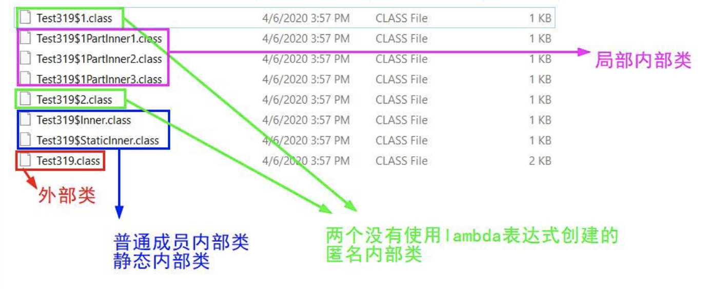

## 仙豆智能


### 一面

#### 1、内部类和外部类的区别

**内部类种类**

* 成员内部类（类似于普通成员变量和成员方法）

  内部类中，不能定义静态成员。

  在内部类中访问外部类中与内部类同名的实例变量用外部类名.this.变量名 Outer.this.i

  初始化内部类对象。

  ```java
  Outer out = new Outer();
  Outer.Inner outin = out.new Inner();
  outin.innerF1();
  ```

  

* 局部内部类（在方法内定义的类）

  不能定义静态成员。

  如果内部类没有与外部类同名的变量，在内部类中可以直接访问外部类的实例变量。

  可以访问外部类的局部变量(即方法内的变量)，但是变量必须是final的。

  用外部类名.this.内部类变量名访问的是外部类变量  Outer.this.i

  

* 静态内部类（也是成员类，但是是静态的）

  初始化静态内部类对象。

  ```
  Outer.Inner in = new Outer.Inner();
  ```

  静态内部类中可以定义静态或者非静态的成员。

  静态内部类只能访问外部类的静态成员(包括静态变量和静态方法)


* 匿名内部类（匿名内部类就是没有名字的内部类）
  1. 一个匿名内部类一定是在new的后面，用其隐含实现一个接口或实现一个类。
  2. 因匿名内部类为局部内部类，所以局部内部类的所有限制都对其生效。

```java
public class Test319 {
    private static class StaticInner{ }//静态内部类

    private class Inner{}//成员内部类

    public void outerFunction1(){
        class PartInner3{}//局部内部类3
    }
    public void outerFunction2(){
        class PartInner1{}//局部内部类1
        class PartInner2{}//局部内部类2
    }

    public Thread thread1 = new Thread(new Runnable() {//匿名内部类1
        @Override
        public void run() {
        }
    }, "thread1");
    public Thread thread2 = new Thread(new Runnable() {//匿名内部类2
        @Override
        public void run() {
        }
    }, "thread2");
    public Thread thread3 = new Thread(()->{//匿名内部类（使用lambda表达式）

    },"thread3");
}
```

内部类的编译后生成的文件：



#### 2、HTTP 协议和 TCP 协议

HTTP 是基于 TCP/IP 协议的应用层协议。它不涉及数据包（packet）传输，主要规定了客户端和服务器之间的通信格式，默认使用80端口。

HTTP/1.0 版的主要缺点是，每个TCP连接只能发送一个请求。发送数据完毕，连接就关闭，如果还要请求其他资源，就必须再新建一个连接。

TCP连接的新建成本很高，因为需要客户端和服务器三次握手，并且开始时发送速率较慢（slow start）。所以，HTTP 1.0版本的性能比较差。随着网页加载的外部资源越来越多，这个问题就愈发突出了。

1.1 版的最大变化，就是引入了持久连接（persistent connection），即TCP连接默认不关闭，可以被多个请求复用，不用声明`Connection: keep-alive`。

客户端和服务器发现对方一段时间没有活动，就可以主动关闭连接。不过，规范的做法是，客户端在最后一个请求时，发送`Connection: close`，明确要求服务器关闭TCP连接。


#### 3、TCP 的三握手，如何保证数据的可靠性传输

网络文件夹 「TCP IP 协议族」文件。


#### 4、构造方法的执行顺序和普通成员变量的初始化顺序

父类静态属性（成员变量） > 父类静态代码块 >

子类静态属性 > 子类静态代码块 >

父类非静态属性 > 父类非静态代码块 > 父类构造器 >

子类非静态属性 > 子类非静态代码块 > 子类构造器


### 二面

#### 1、String a = new String("13")，会创建几个对象。一个或两个

String a = "123";  0 个或 1 个。 


#### 2、一个链表如何找到中间节点，倒数第三个节点。

双指针。


#### 3、100万个数里找到最大的 10 个数

小顶堆的数据结构。时间复杂度。100万*log （10）

